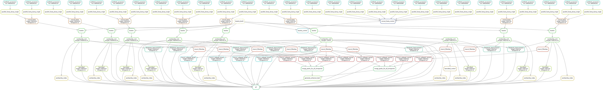

# enhancer-definition

This directory contains the `snakemake` pipeline for public 3T3-L1 preadipocyte histone ChIP-seq (GSE21365) to define enhancers in this study.
ChIP-seq data under GEO accession GSE21365 are generated from four different timepoints during adipocyte differentiation (proliferating preadipocytes, confluent preadipocytes, immature adipocytes and mature adipocytes).
In this study, enhancers are defined as the union of `H3K27ac` and `H3K4me1` histone modification peaks from those four timepoints.

This pipeline automatically fetches relevant ChIP-seq data (4 timepoints * 2 histone marks = 8 sequencing experiments + 10 control runs) from SRA and dumps them into fastq file.
Using `bowtie > macs2` ChIP-seq peak calling procedure, we obtain `H3K27ac` and `H3K4me1` peak for each timepoint and they are finally merged to produce enhancer annotation throughout `mm10` genome.

**Pipeline overview**

