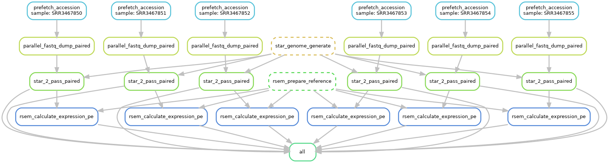

# GSE80961 RNA-seq data (GSE80960, SRP074207) processing

This directory contains the `snakemake` pipeline for public RNA-seq data (GEO accession GSE80960, SRA study accession SRP074207) processing.

**Overview**

