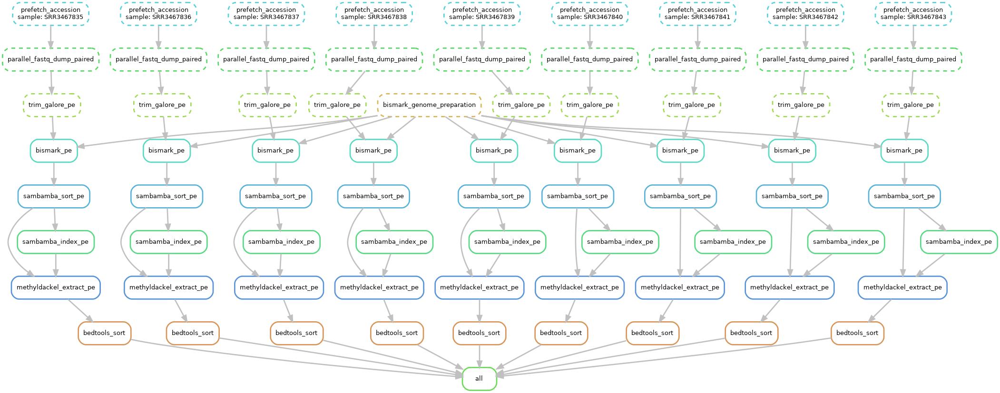

# GSE80961 RRBS data (GSE80959, SRP074206) processing

This directory contains the `snakemake` pipeline for public RNA-seq data (GEO accession GSE80959, SRA study accession SRP074206) processing.

**Output**

This pipeline produces the following output for each `sample` (i.e., sequencing run):

- `result/03_methyldackel/pe/{sample}_CpG.sorted.bedGraph` : per-CpG methylation level (in integer  %) with the numbers of methylated / unmethylated cytosines produced by `MethylDackel`

**Pipeline overview**

