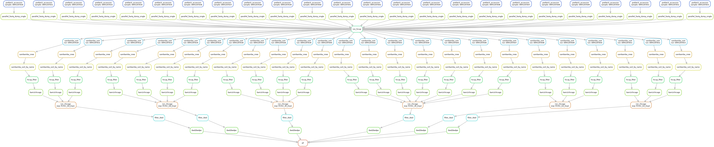

# pcHi-C data processing pipeline

This directory contains the `snakemake` pipeline for pcHi-C data processing. 

## Before running the pipeline

Some pre-configurations are needed to run this `HiCUP-CHiCAGO` pipeline for pcHi-C.

**Input preparation for HiCUP and execution**

1. Digest reference genome
    
    *This step is optional as we provide the resulting `Digest_Mouse_mm10_HindIII_None_21-04-23_21-06-2021` file*

    HiCUP requires *in silico*-digested reference genome information.
    The PC-HiC data we're going to use used HindIII restriction enzyme, so we provide HindIII and its restriction site to the digester.
    You may need to adjust `mm10.fa` to point reference genome location in your setting.
    ```
    hicup_digester --genome Mouse_mm10 --re1 A^AGCTT,HindIII mm10.fa
    ```

2. Configure HiCUP config file (`hicup_pc_hic.conf`).

    You need to adjust `Index` parameter in HiCUP configurations according to the location of bowtie2 index in your setting.

**Input preparation for CHiCAGO run**

We need two files (`.rmap` and `.baitmap`) to prepare design files for CHiCAGO run.

0. Prepare `chicago_design_dir`

```
mkdir chicago_design_dir
```

1. Restriction map file (.rmap)

    Run the command below to prepare `.rmap` file from HindIII-digested genome information.

    ```shell
    cat Digest_Mouse_mm10_HindIII_None_21-04-23_21-06-2021.txt |\
    tail -n+3 |\
    cut -f1-4 |\
    awk 'BEGIN {FS=OFS="\t"} {print $1,$2,$3,NR}' \
    > chicago_design_dir/mm10_HindIII.rmap
    ```

2. Baitmap file (.baitmap)

    Run the command below to prepare `.baitmap` file from PC-HiC RNA baits.

    ```shell
    bedtools intersect \
    -a pc_hic.rna_baits.mm10.bed \
    -b chicago_design_dir/mm10_HindIII.rmap -wb |\
    awk 'BEGIN {FS=OFS="\t"} {print $7,$8,$9,$10,$5}' |\
    awk -F"\t" '!seen[$4]++' |\
    > chicago_design_dir/mm10_HindIII.baitmap
    ```

3. nperbin, nbaitsperbin and proxOE file (`.npb`, `.nbpb` and `.poe`)

    Run `makeDesignFiles.py` as below to prepare all the other required files.

    ```
    python scripts/makeDesignFiles.py \
    --minFragLen=150 \
    --maxFragLen=40000 \
    --rmapfile=chicago_design_dir/mm10_HindIII.rmap \
    --baitmapfile=chicago_design_dir/mm10_HindIII.baitmap \
    --designDir=chicago_design_dir \
    --outfilePrefix=mm10_HindIII
    ```

**About PC-HiC RNA baits used**

For CHiCAGO run, we downloaded PC-HiC RNA baits from the published supplementary data (Schoenfelder et al. 2015) and lifted-over them from mm9 to mm10 using the command below.

```
liftOver pc_hic.rna_baits.mm9.bed mm9ToMm10.over.chain pc_hic.rna_baits.mm10.bed pc_hic.rna_baits.mm10.unmapped.bed
```

mm9-to-mm10 Chain file is from UCSC (https://hgdownload.soe.ucsc.edu/goldenPath/mm9/liftOver/mm9ToMm10.over.chain.gz).

**Pipeline overview**

