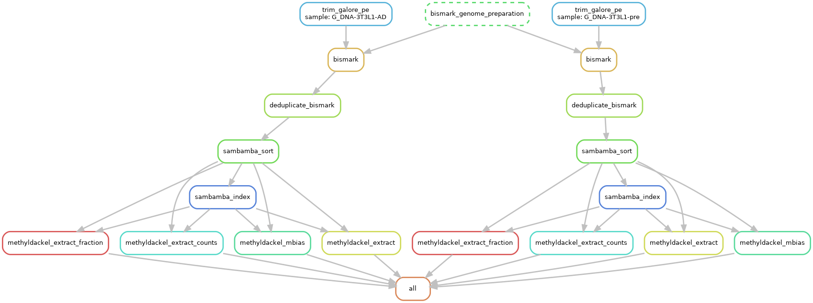

# WGBS data processing

This directory contains the `snakemake` pipeline for WGBS data processing.

**Output**

This pipeline produces the following outputs:

- `result/{sample}.bismark.deduplicated.sorted_CpG.meth.bedGraph` : per-CpG methylation level.
- `result/{sample}.bismark.deduplicated.sorted_CpG.counts.bedGraph` : per-CpG read depths.
- `result/{sample}.bismark.deduplicated.sorted_CpG.bedGraph` : per-CpG methylation level (integer %) with the numbers of methylated C and unmethylated C.
- `result/{sample}.bismark.deduplicated.sorted.mbias.tsv` : M-bias report from `MethylDackel`. Can be used for the quality control of bisulfite sequencing data.

**Overview**

