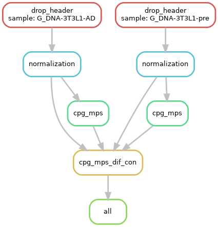

# WGBS DMR calling

This directory contains the `snakemake` pipeline for WGBS DMR calling using `CpG_MPs`.

Please note that the binary files in this directory (`CpG_MPs`, `CpG_MPs_Dif_Con`, `Normalization`) is copied from the official GitHub repo of `CpG_MPs` (https://github.com/Kinspact/CpG_MPs).

**Overview**

